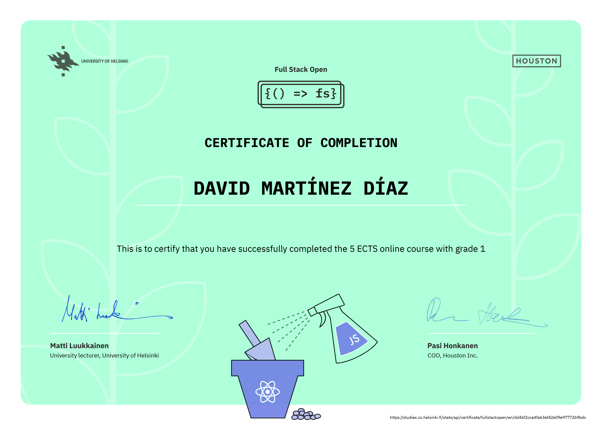

# Curso FullStackOpen

## Indice

### [Part 0](https://github.com/Duva-01/Curso-FullStackOpen/edit/main/Part0) (2022-2023)  

En esta parte, nos familiarizaremos con los aspectos prácticos de tomar el curso. Después de eso, tendremos una visión general de los fundamentos del desarrollo web y también hablaremos sobre los avances en el desarrollo de aplicaciones web durante las últimas décadas.

### [Part 1](https://github.com/Duva-01/Curso-FullStackOpen/edit/main/Part1) (2022-2023)  

En la Parte 1 del Curso Full Stack, nos familiarizamos con la librería React y exploramos algunas características importantes de JavaScript para comprender mejor cómo trabajar con React. A continuación se presenta un resumen de los temas que cubrimos en esta parte del curso.

#### a. Introducción a React

En esta sección, aprendimos los conceptos básicos de React y cómo configurar un proyecto de React utilizando Create React App. Aprendimos a crear componentes de React, a utilizar JSX para escribir código HTML dentro de JavaScript y a componer componentes para construir interfaces de usuario más complejas. También exploramos el enlace de datos unidireccional en React y cómo los componentes pueden aceptar propiedades (props) para personalizar su comportamiento y apariencia.

#### b. JavaScript

Dedicamos tiempo a repasar las características clave de JavaScript que son relevantes para trabajar con React. Cubrimos conceptos como variables, tipos de datos, funciones, arrays, objetos y bucles. Aprendimos cómo utilizar métodos de array como map, filter y reduce para manipular y transformar datos. También exploramos funciones de flecha, desestructuración de objetos y el uso del operador spread para copiar y combinar datos.

#### c. Estado del componente, controladores de eventos

En esta sección, profundizamos en el concepto de estado en los componentes de React. Aprendimos cómo utilizar el hook `useState` para definir y actualizar el estado de un componente. También exploramos cómo los eventos se manejan en React y cómo podemos definir controladores de eventos en nuestros componentes. Practicamos la actualización del estado en respuesta a eventos y vimos ejemplos de cómo mostrar y ocultar elementos en función del estado.

#### d. Un estado más complejo, depurando aplicaciones React

En esta última sección, avanzamos hacia estados más complejos en nuestros componentes. Aprendimos a manejar estados de objetos y arreglos, y cómo actualizar partes específicas del estado utilizando la función `setState`. También exploramos herramientas de depuración en React, como la extensión React Developer Tools y el uso de `console.log` para inspeccionar el estado y el flujo de datos en nuestras aplicaciones.

### [Part 2](https://github.com/Duva-01/Curso-FullStackOpen/edit/main/Part2) (2022-2023)  

En la Parte 2 del Curso Full Stack, nos centramos en mejorar la funcionalidad y la experiencia del usuario en nuestros proyectos. Veamos el progreso que logramos en tres proyectos: "Información del Curso", "Países" y "Agenda Telefónica".

#### Información del Curso

En el proyecto de Información del Curso, implementé características adicionales para gestionar los datos de los cursos. Creé un formulario para agregar nuevos cursos, permitiendo a los usuarios ingresar el nombre del curso y el número de ejercicios. También implementé una función para calcular el número total de ejercicios de todos los cursos. Para lograr esto, utilicé la función `reduce` para recorrer el array de cursos y acumular la cantidad de ejercicios.

#### Países

En el proyecto de Países, amplié la funcionalidad para buscar y mostrar información sobre varios países. Me integré con la API REST Countries para obtener datos como el nombre del país, la capital, la población, los idiomas y la bandera. Implementé una función de búsqueda que permite a los usuarios filtrar los países por nombre, lo que hace que la aplicación sea más fácil de usar. Además, agregué un botón para mostrar información detallada sobre un país específico, mostrando datos adicionales como la moneda, las zonas horarias y los bloques regionales.

#### Agenda Telefónica

En el proyecto de la Agenda Telefónica, creé una aplicación sencilla de agenda telefónica utilizando React y un servidor backend. Me integré con un servidor Express.js e implementé funcionalidades para agregar, eliminar y filtrar contactos. Utilicé la biblioteca Axios para manejar las solicitudes HTTP al servidor backend y gestioné el estado de los contactos utilizando el hook `useState` de React. Además, implementé verificaciones de validación para evitar la entrada de contactos duplicados y proporcioné comentarios al usuario a través de alertas.

Para mejorar la experiencia del usuario, agregué notificaciones para mostrar mensajes de éxito o error al realizar operaciones como agregar, actualizar o eliminar contactos. También mejoré el manejo de errores al mostrar mensajes de error y registrarlos en la consola con fines de depuración.

Además, abordé el problema de sincronización que surge cuando varios usuarios interactúan con la aplicación al mismo tiempo. Para manejar esto, introduje la versión del objeto en el servidor backend y modifiqué el código frontend para incluir la versión al realizar operaciones como eliminar contactos. Este enfoque garantiza la consistencia de los datos y evita conflictos al eliminar contactos en diferentes instancias del navegador.

### [Part 3](https://github.com/Duva-01/Curso-FullStackOpen/edit/main/Part3) (2022-2023)  

En esta parte del curso, nos enfocamos en el desarrollo del backend, que implica implementar la funcionalidad del lado del servidor. Utilizamos Node.js y la biblioteca Express para construir una API REST. Además, almacenamos los datos de nuestra aplicación en una base de datos MongoDB. Al final de esta parte, tenemos nuestra aplicación completamente funcional y lista para ser implementada en Internet.

#### Implementación de la aplicación en Internet

En esta sección, nos centramos en implementar nuestra aplicación en Internet para que esté disponible públicamente. Utilizamos la plataforma de alojamiento Render, que nos permite implementar aplicaciones Node.js de forma sencilla y sin complicaciones. Sigue las instrucciones proporcionadas para configurar y desplegar tu aplicación en Render.

#### Guardando datos en MongoDB

Una parte fundamental de nuestra aplicación es el almacenamiento de datos en una base de datos. En este caso, utilizamos MongoDB, una base de datos NoSQL ampliamente utilizada. Aprendimos cómo establecer una conexión con MongoDB Atlas, un servicio en la nube para MongoDB, y cómo realizar operaciones de creación, lectura, actualización y eliminación de datos en nuestra base de datos. Sigue las instrucciones detalladas para configurar y utilizar MongoDB Atlas en tu aplicación.

#### Validación y ESLint

La validación de datos es esencial para garantizar la integridad y la consistencia de nuestra aplicación. Aprendimos cómo utilizar el paquete mongoose-unique-validator para garantizar que los nombres de las personas en nuestra agenda sean únicos. Además, utilizamos ESLint, una herramienta de análisis de código estático, para detectar y corregir errores de estilo y mantener un código limpio y legible. Sigue las instrucciones proporcionadas para configurar la validación y el ESLint en tu proyecto.

### [Part 4](https://github.com/Duva-01/Curso-FullStackOpen/edit/main/Part4) (2022-2023)  

En esta parte del curso FullStack, hemos avanzado en el desarrollo del backend de nuestra aplicación. Ya hemos aprendido sobre diferentes aspectos importantes, como escribir pruebas de unidad e integración, la estructura de la aplicación backend, la administración de usuarios y la autenticación de tokens.

Comenzamos entendiendo la estructura de nuestra aplicación backend y cómo organizar los archivos y las rutas. Aprendimos cómo utilizar el enfoque modular para crear controladores y modelos, y cómo conectarlos mediante enrutadores.

Luego, nos sumergimos en el emocionante mundo de las pruebas de unidad e integración. Aprendimos a utilizar herramientas populares como Jest y Supertest para escribir pruebas exhaustivas para nuestro backend. Creamos pruebas para diferentes escenarios, como verificar el total de "likes" de los blogs, encontrar el blog favorito, y asegurarnos de que los usuarios y blogs se guarden correctamente en la base de datos.

Después, nos adentramos en la administración de usuarios. Implementamos funcionalidades como el registro de nuevos usuarios, el inicio de sesión y la visualización de la lista de usuarios. Utilizamos técnicas de encriptación con bcrypt para almacenar de forma segura las contraseñas de los usuarios en la base de datos.

Finalmente, llegamos a la autenticación de tokens. Implementamos un sistema de autenticación basado en tokens utilizando JSON Web Tokens (JWT). Aprendimos cómo generar y verificar tokens, y cómo utilizarlos para proteger las rutas y permitir el acceso solo a usuarios autenticados.

En cada paso del camino, aplicamos lo que aprendimos en proyectos prácticos, como el proyecto de la lista de blogs. Creamos una API RESTful para gestionar blogs y usuarios, asegurándonos de que las operaciones básicas como crear, leer, actualizar y eliminar estén correctamente implementadas. Además, realizamos pruebas exhaustivas para garantizar que nuestro backend funcione de manera confiable y cumpla con los requisitos esperados.

### [Part 5](https://github.com/Duva-01/Curso-FullStackOpen/edit/main/Part5) (2022-2023)  

En esta parte del curso Full Stack, exploramos el desarrollo del frontend de nuestra aplicación y abordamos varios aspectos importantes. A continuación, compartiré mi experiencia y lo que aprendí en cada una de las secciones.

#### Iniciar sesión en la interfaz

En esta sección, nos centramos en implementar la funcionalidad de inicio de sesión en la interfaz de nuestra aplicación. Aprendimos cómo configurar un formulario de inicio de sesión y cómo enviar solicitudes de autenticación al servidor. Además, exploramos cómo almacenar el token de autenticación en el cliente y cómo utilizarlo para autorizar las solicitudes futuras. Esta sección fue fundamental para comprender cómo se establece la comunicación entre el frontend y el backend de una aplicación.

#### Props.children y PropTypes

En esta sección, profundizamos en el uso de las propiedades (props) en React y exploramos el concepto de `props.children`. Aprendimos cómo utilizar `props.children` para pasar componentes anidados y contenido adicional a través de los componentes padres. Además, aprendimos a utilizar la biblioteca PropTypes para validar las propiedades y asegurarnos de que se proporcionen los tipos de datos correctos. Esta sección fue muy útil para comprender cómo estructurar y pasar datos entre los componentes de nuestra aplicación de manera eficiente y segura.

#### Probando aplicaciones React

En esta sección, nos sumergimos en el mundo de las pruebas en aplicaciones React. Aprendimos diferentes técnicas y herramientas para realizar pruebas unitarias y de integración en nuestros componentes. Exploramos el uso de bibliotecas populares como Jest y React Testing Library para realizar pruebas precisas y eficientes. Aprendimos a simular eventos, verificar resultados y realizar pruebas asincrónicas. Esta sección fue muy interesante y me permitió asegurarme de que mi código React funcionara correctamente en diferentes escenarios.

#### Pruebas de extremo a extremo

En esta sección final, nos adentramos en las pruebas de extremo a extremo utilizando Cypress. Aprendimos a configurar Cypress en nuestra aplicación y a escribir pruebas que simulan las acciones de los usuarios y verifican el comportamiento de la aplicación en su conjunto. Realizamos pruebas de navegación, interacción con formularios y verificación de elementos en la interfaz. Esta sección fue muy práctica y nos ayudó a garantizar la calidad y la funcionalidad de nuestra aplicación en un entorno más realista.

#### Conclusiones y Proyecto Lista blogs

En general, esta parte del curso Full Stack fue muy enriquecedora y me proporcionó un conocimiento sólido sobre el desarrollo del frontend de aplicaciones web. Aprendí a implementar funcionalidades clave, como la autenticación de usuarios, y a realizar pruebas exhaustivas para garantizar el buen funcionamiento de mi código. También adquirí experiencia en el uso de bibliotecas y herramientas populares en el ecosistema de React, lo cual me permitió desarrollar aplicaciones más robustas y de alta calidad.

Para el proyecto final de esta parte del curso, tuve que aplicar todos los conceptos y técnicas aprendidas. Implementé una lista de blogs donde los usuarios pueden crear, ver, editar y eliminar blogs. Utilicé React para desarrollar la interfaz de usuario, implementé la autenticación basada en tokens para la seguridad y realicé pruebas tanto unitarias como de extremo a extremo para asegurarme de que la funcionalidad estuviera correctamente implementada.